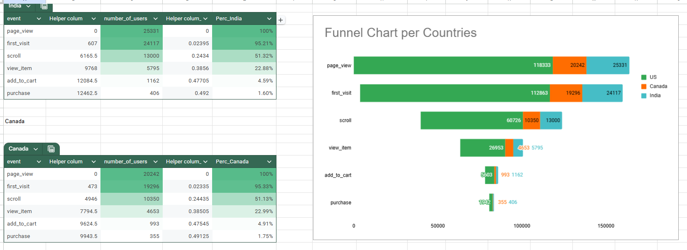
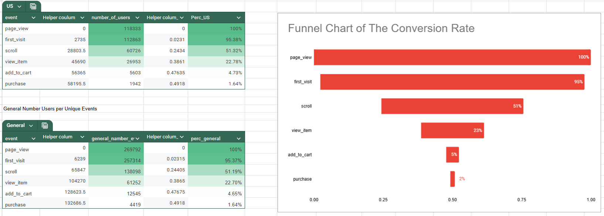
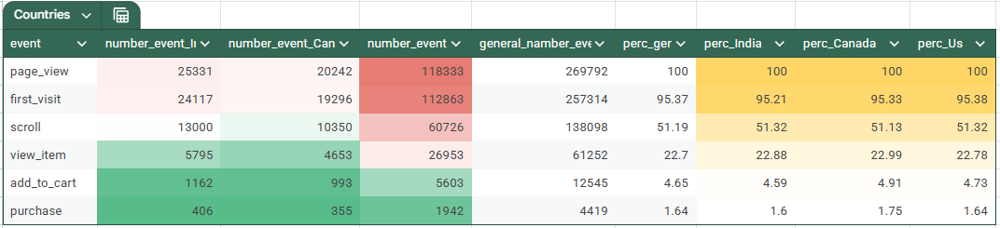

# Funnel Analysis
---

## Overview

This project analyzes user events data to create a sales funnel chart, focusing on unique events and comparing data from the top three countries.

## Key Steps

1. **Data Exploration:** 
   - Examined the events table to identify and understand key user actions.

2. **Unique Events Query:**
   - Developed a SQL query to filter out duplicates, ensuring only one unique event per user ID for accurate analysis.

3. **Event Selection:**
   - Selected 4 to 6 relevant event types to construct a meaningful sales funnel.

4. **Country Aggregation:**
   - Identified top three countries by event count and aggregated results for comparative analysis.

5. **Data Organization:**
   - Created a structured table showing event order and percentage drop-off, utilizing both SQL and spreadsheets for processing.

6. **Visualization and Insights:**
   - Generated funnel chart(s) to visualize user journey differences across the top countries, enhancing clarity with conditional formatting.
   - Offered insights into user behavior and suggested further analysis opportunities.

This concise approach enabled effective visualization of user interactions and extraction of actionable insights from the sales funnel analysis.

---

## 🛠️ Methodology

### Data Processing

The link for the SQL query: [Add SQL Query Link Here]

## 📈 Results & Visualizations

